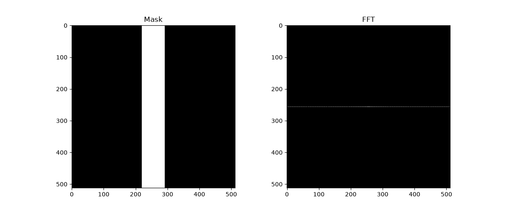
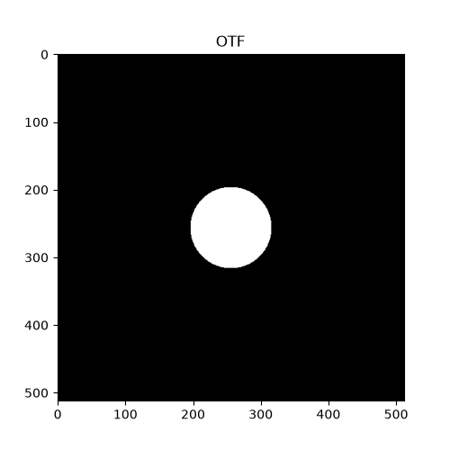
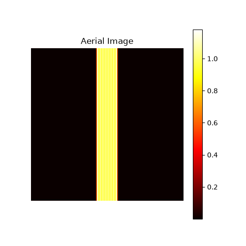
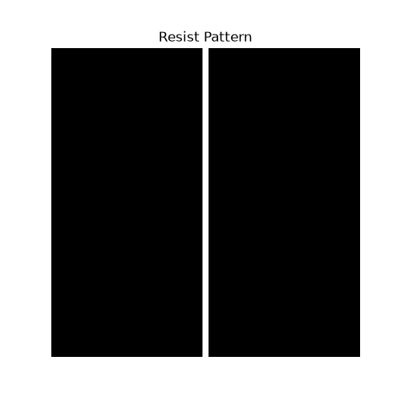
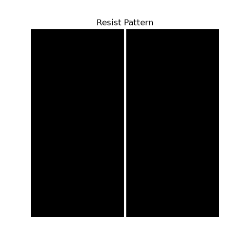
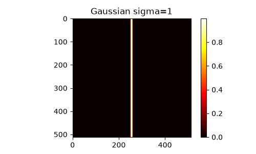
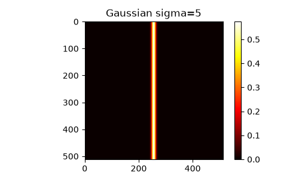
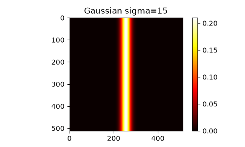

## Status

- [v] Fourier Optics simulation
- [v] FFT based diffraction analysis
- [v] OTF lens filtering
- [v] Aerial image generation
- [v] Threshold resist modeling
- [v] Gaussian exposure modeling

## Implementation

### 1. Mask Pattern Generation

```python
import numpy as np

N = 512

mask = np.zeros((N, N))

# Line pattern
mask[:,252:260] = 1
```

---

### 2. Fourier Transform (Mask → Frequency Domain)

```python
# FFT
mask_fft = np.fft.fft2(mask)

# Shift DC component to center
mask_fft_shift = np.fft.fftshift(mask_fft)
```

- `fft2()` : Spatial domain의 Mask pattern을 frequency domain으로 변환
- `fftshift()` : Diffraction spectrum을 중심 기준으로 시각화

---

### 3. Optical Transfer Function (OTF) Modeling

```python
Y, X = np.ogrid[:N, :N]

center = N // 2

radius = np.sqrt(
    (X-center)**2 + (Y-center)**2
)

cutoff = 30

OTF = (radius < cutoff).astype(float)
```

Lens가 전달 가능한 spatial frequency 범위를 원형 aperture로 모델링하였다.

---

### 4. Frequency Filtering

```python
filtered_fft = mask_fft_shift * OTF
```

OTF를 적용하여 Lens가 전달하지 못하는 high spatial frequency 성분을 제거한다.

---

### 5. Aerial Image Generation

```python
aerial = np.fft.ifft2(
    np.fft.ifftshift(filtered_fft)
)

intensity = np.abs(aerial)**2
```

Frequency domain의 정보를 다시 spatial domain으로 변환하여 wafer 위치에서의 optical intensity distribution을 계산한다.

---

### 6. Threshold-based Resist Pattern

```python
threshold = 0.2

resist = (intensity > threshold).astype(float)
```

Aerial image intensity가 threshold보다 높은 영역을 exposure 영역으로 판단하여 resist pattern을 생성한다.

---

### 7. Gaussian Exposure Model

```python
from scipy.ndimage import gaussian_filter

aerial_gaussian = gaussian_filter(
    mask,
    sigma=5
)
```

Gaussian blur를 이용하여 optical spreading effect를 단순 모델링하였다.

## Experiment Result

### 1. FFT Analysis






Mask pattern을 frequency domain으로 변환하여 diffraction spectrum을 확인하였다.

---

### 2. OTF Cutoff Effect




Cutoff 감소 시 high spatial frequency 손실로 인해 edge sharpness가 감소하였다.

---

### 3. Threshold Effect




threshold 감소 시 노광이 되었다고 판단하는 영역이 증가하여 CD가 감소하였다.

### 3. Gaussian Exposure Model





Sigma 증가에 따라 optical spreading이 증가하고 aerial image profile이 변화하였다.