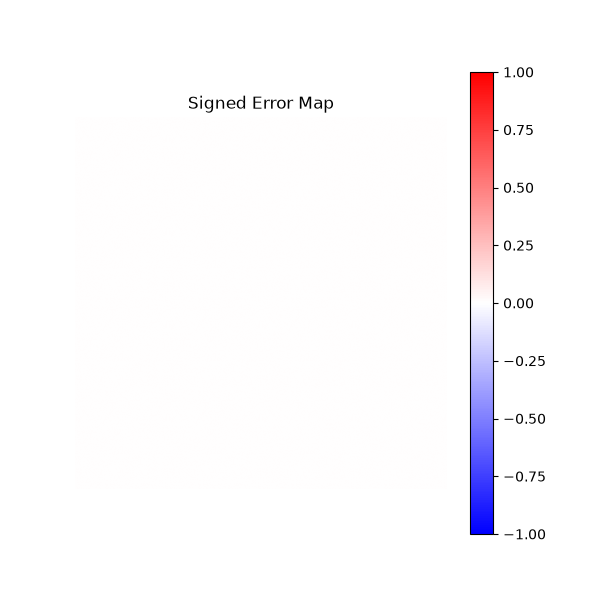
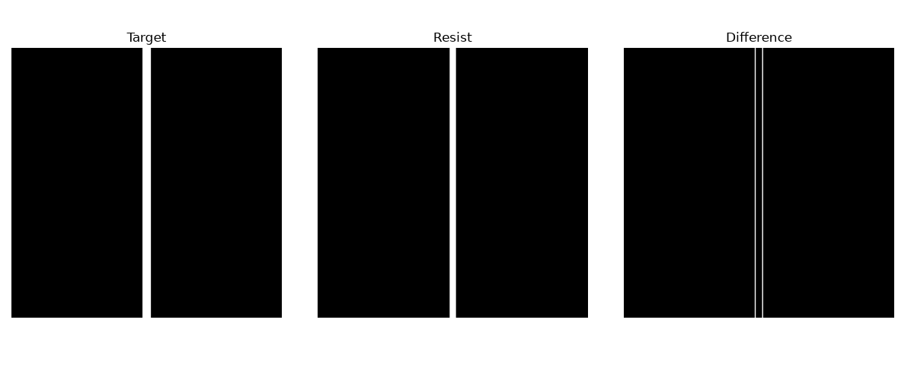
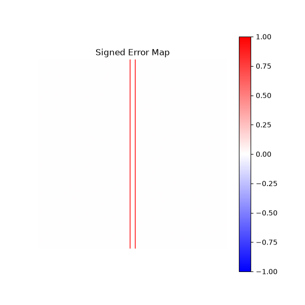
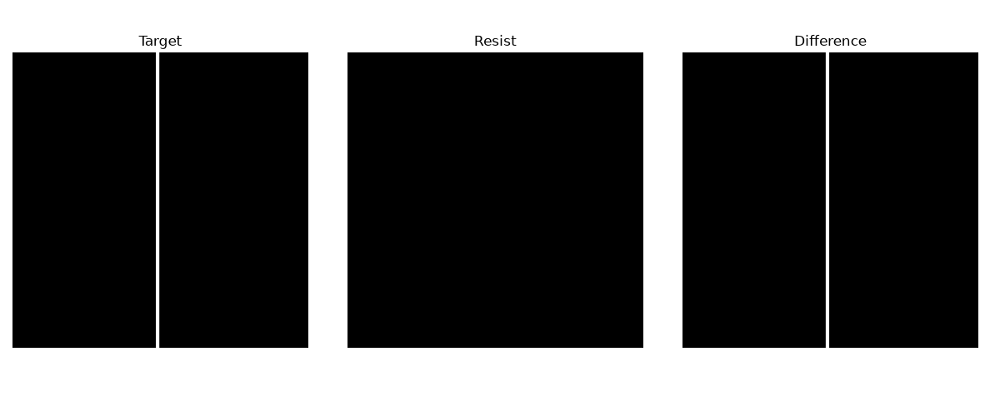
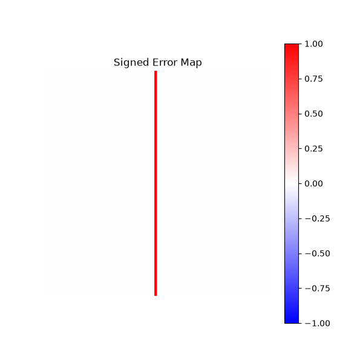
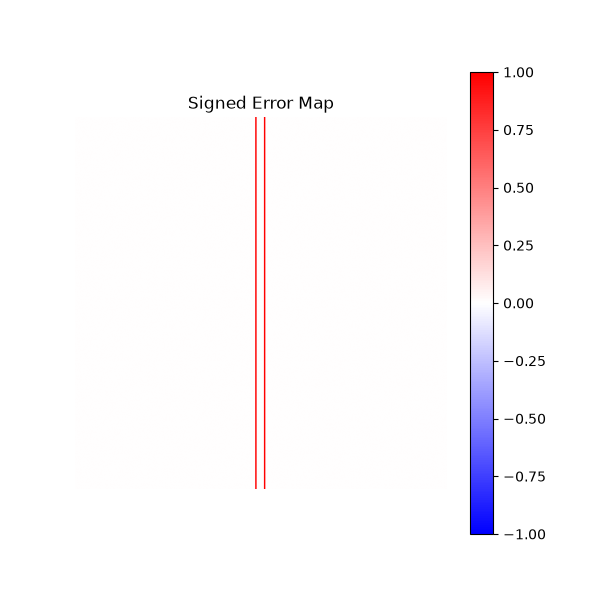

# Day 5 - Lithography Result Analysis

## 프로젝트 목표

Day 5에서는 Lithography Simulation 결과를 **정량적으로 분석하는 모듈**을 구현하였다.

기존에는 Target Pattern과 Resist Pattern을 시각적으로 비교하는 수준이었다면, 이번 단계에서는 Error Map, CD(Critical Dimension), Edge Detection, EPE(Edge Placement Error) 등을 계산하여 Lithography 결과를 수치적으로 평가할 수 있도록 프로젝트를 확장하였다.

---

# 구현 기능

* ✅ Difference Map
* ✅ Signed Error Map
* ✅ Error Pixel 계산
* ✅ Error Rate 계산
* ✅ Edge Detection
* ✅ CD(Critical Dimension) 계산
* ✅ EPE(Edge Placement Error) 계산
* ✅ Resolution Status 판별

---

# 실험 1 (기준 조건)

### 조건

| Parameter  | Value |
| ---------- | ----: |
| Mask Width | 16 px |
| Cutoff     |    40 |
| Threshold  |   0.3 |

### 결과

| 항목         | 결과       |
| ---------- | -------- |
| Error Rate | 0%       |
| CD         | 16 px    |
| Resolution | Resolved |

### 결과 이미지

---

# 실험 2 (Cutoff 감소)

### 조건

| Parameter  | Value |
| ---------- | ----: |
| Mask Width | 16 px |
| Cutoff     |    20 |
| Threshold  |   0.3 |

### 결과

| 항목         | 결과       |
| ---------- | -------- |
| Error Rate | 0%       |
| CD         | 16 px    |
| Resolution | Resolved |

### 결과 분석

Cutoff를 절반으로 감소시켰지만 패턴은 정상적으로 인쇄되었다.

현재 사용한 Line Pattern은 비교적 폭이 넓기 때문에 광학계가 일부 고주파 성분을 잃더라도 충분히 패턴을 재현할 수 있음을 확인하였다.

---

# 실험 3 (Threshold 증가)

### 조건

| Parameter  | Value |
| ---------- | ----: |
| Mask Width | 16 px |
| Cutoff     |    20 |
| Threshold  |   0.5 |

### 결과

| 항목         | 결과       |
| ---------- | -------- |
| Error Rate | 25%      |
| CD         | 12 px    |
| Resolution | Resolved |

### 결과 이미지

### 결과 분석

Threshold를 증가시키자 Resist Pattern이 축소되었으며, CD가 16 pixel에서 12 pixel로 감소하였다.

Edge Placement Error(EPE)를 통해 Edge가 Target 위치보다 안쪽으로 이동한 것을 확인하였다.

---

# 실험 4 (Resolution Limit)

### 조건

| Parameter  | Value |
| ---------- | ----: |
| Mask Width |  6 px |
| Cutoff     |    20 |
| Threshold  |   0.5 |

### 결과

| 항목         | 결과           |
| ---------- | ------------ |
| Error Rate | 100%         |
| CD         | 0 px         |
| Resolution | Not Resolved |

### 결과 이미지

### 결과 분석

Mask Width를 6 pixel까지 감소시키자 Resist Pattern이 완전히 소실되었다.

Edge Detection이 불가능하여 CD와 EPE를 계산할 수 없었으며, Resolution Status는 **Not Resolved**로 판정되었다.

이를 통해 광학계의 Resolution Limit에서는 단순한 공정 조건 변경만으로는 패턴을 재현할 수 없음을 확인하였다.

---
# 실험 5
# 실험 4 조건 그대로 resolved / not resolved 확인

# 실험 4 조건에서 mask 12, cutoff 40 변환

# 실험 결과 요약

| Experiment | Mask Width | Cutoff | Threshold | Error Rate |    CD | Resolution   |
| ---------- | ---------: | -----: | --------: | ---------: | ----: | ------------ |
| Exp.1      |      16 px |     40 |       0.3 |         0% | 16 px | Resolved     |
| Exp.2      |      16 px |     20 |       0.3 |         0% | 16 px | Resolved     |
| Exp.3      |      16 px |     20 |       0.5 |        25% | 12 px | Resolved     |
| Exp.4      |       6 px |     20 |       0.5 |       100% |  0 px | Not Resolved |

---

# 이번 실습에서 배운 점

* Cutoff 감소만으로는 폭이 넓은 패턴은 정상적으로 재현될 수 있다.
* Threshold가 증가하면 Resist Pattern이 축소되어 CD가 감소한다.
* Pattern Width가 광학계의 Resolution Limit보다 작아질 경우 Pattern이 완전히 소실될 수 있다.
* EPE는 Pattern Edge의 위치 오차를 정량적으로 평가하는 중요한 지표이다.
* 이러한 광학적 한계를 보완하기 위해 OPC(Optical Proximity Correction)가 필요하다.

---

# 다음 단계

Day 6에서는 Error Analysis 결과를 이용하여 **Mask를 직접 수정하는 Rule-Based OPC 알고리즘**을 구현한다.

Lithography Simulation → Error Analysis → Mask Correction → Re-Simulation의 반복 과정을 구현하여 Error를 감소시키는 것을 목표로 한다.
