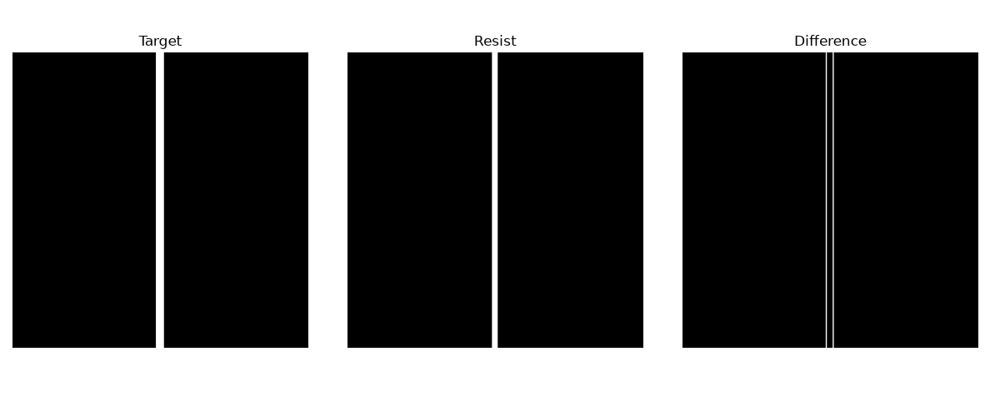
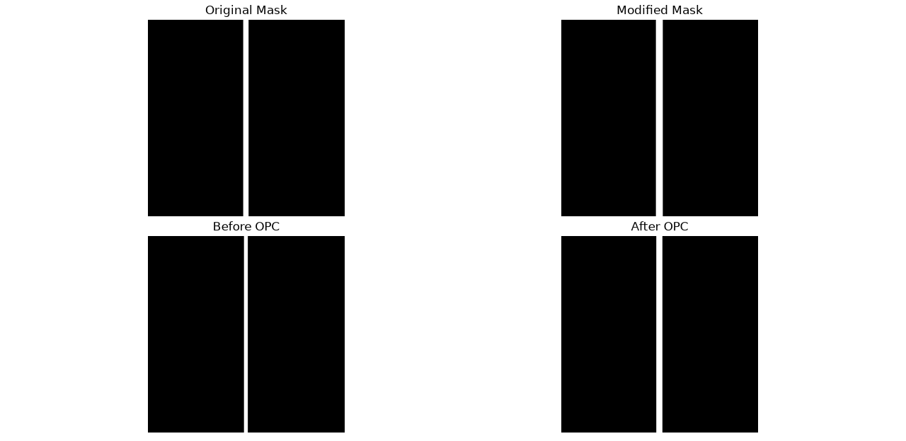
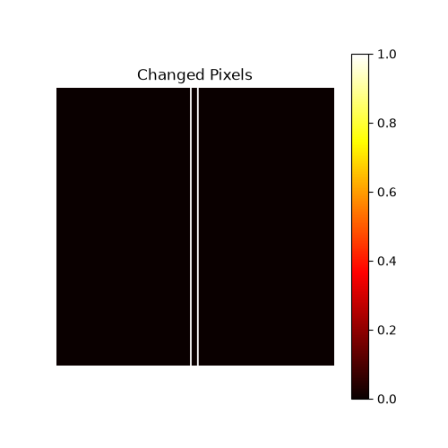

# Day6 - First OPC Implementation

# 구현 내용
Difference Map 계산
Signed Error Map 생성
Edge Placement Error(EPE) 계산
Resolution Check
EPE 기반 Mask 수정
OPC 전/후 결과 비교

# 결과
===== Before OPC =====
Error Pixels : 2048.0
Error Rate   : 28.57%
Left Edge  : 250
Right Edge : 259
CD Width   : 10 pixels
Left EPE  : 2 pixels
Right EPE : -2 pixels
Resolution Status : Resolved

===== After OPC =====
Error Pixels : 1024.0
Error Rate   : 14.29%
Left Edge  : 247
Right Edge : 262
CD Width   : 16 pixels
Left EPE   : -1
Right EPE  : 1

===== OPC Summary =====
Error Rate : 28.57% -> 14.29%
Left EPE   : 2 -> -1
Right EPE  : -2 -> 1

